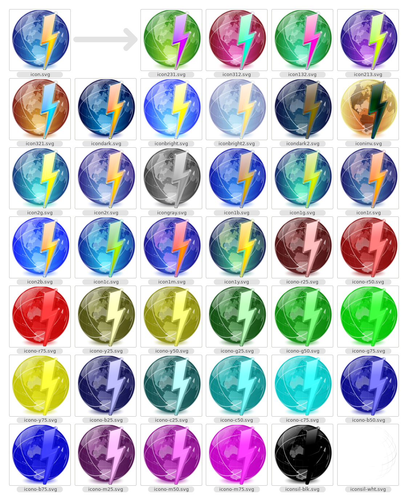

# SVG Spinner

This is a Python script that takes an SVG (Scalable Vector Graphics) image and creates a number of distinct variations by "spinning" its colors in a variety of ways.

It takes a path to a SVG file as input, and outputs the spun versions (of which it can generate 40) to the same directory.

It runs like this:
```python3 spin.py /path/to/input.svg```

## Transformations
Image files are much larger than text files, and much more complicated, so how is it possible to do this using only string functions and basic math? <br />
The answer is XML, or eXtensible Markup Language, which SVGs are written in. This is the same thing that Web pages are written in. A SVG file looks something like this:
```<?xml version="1.0" encoding="UTF-8"?>
<svg xmlns="http://www.w3.org/2000/svg" width="480" height="288">
  <rect fill="#09f911" width="96" height="288"/>
  <rect fill="#029d74" width="96" height="288" x="96"/>
  <rect fill="#e35bd8" width="96" height="288" x="192"/>
  <rect fill="#4156c5" width="96" height="288" x="288"/>
  <rect fill="#635688" width="96" height="288" x="384"/>
  <text font-size="32" fill="#FFFFFF" font-family="Bitstream Vera Sans" x="384" y="273">+<tspan font-size="48">C0</tspan></text>
</svg>

```
While this is a simple little file that draws a simple little flag, nearly all SVGs are constructed in a broadly similar way, meaning that we can just identify RGB triplets in the file and modify them in place. And since these RGB colors are just numbers in hexadecimal, we can do these transformations with pretty simple math.

Each of the transforms applied by this software are done by selecting a set of operations, and then carrying it out on each RGB triplet throughout the SVG file.

An RGB color like is composed of three values denoting the amount of red (`09`), blue (`F9`), and green `(11`). 


## Transforms applied
* Six hue spins: three forward (`123`, `231`, `312`) and three backward (`321`, `213`, `132`)
For each triplet there are six permutations: `#09F911`, for example, gives `#09F911`, `#F91109`, `#1109F9`, `#0911F9`, `#F90911`, and `#11F909`. 
* Invert (`inv`)
All values are inverted (0 becomes 255, 255 becomes 0, and 128 becomes 127).
* Grayscale (`gray`)
For each color, an average is taken of all three values, and this average is then applied to all of them; darks stay dark and lights stay light, but none of them have any hue.
* Silhouettes in black and white (`sil-blk`, `sil-wht`)
All colors in the entire document are replaced with `#000000` or `#FFFFFF`. This turns the image into a silhouette outline.

### Multiplies
In multiplies, the R, G and B values themselves are multiplied or divided by three constants. Anything that goes higher than 255 just stays at 255; anything that goes below 0 stays at 0. Brightening can be done by multiplying R, G and B; other color transforms can be done by selectively multiplying certain color channels.

* Brighten by 2x R, G and B (`bright`)
The 0-255 values of all three channels are multiplied by 2.
* Darken by 1.5x inverse multiplication (`dark`)
For darkening, multiplying the values by 0.5 looks terrible, so instead the value is inverted, a 1.5x multiplication is done on *that*, and it's inverted again after.

* Single-channel color multiply (`2r`, `2g`, `2b`)
For these the R, G or B channels, respectively, are multiplied by 2 and the rest are kept the same. This increases the overall brightness of the image.

* Primary color enhancement (`1r`, `1g`, `1b`)
For these the primary color channels are multiplied by a factor of 4/3, and the other two channels by a factor of 5/6.
* Secondary color enhancement (`1y`, `1c`, `1m`)
Yellow, cyan and magenta are compound colors comprising two channels; for these, both components of the respective color are multiplied by a factor of 4/3, and the other component by 2/3.

### Overlays
In overlays, each color in the SVG is averaged with the overlay color at a given strength.
For example, `#0000FF` overlaid with `#FF0000` would be `#3F00BF` at 25%, `#7F007F` at 50%, `#BF003F` at 75%, and `FF0000` at 100%.

* Brighten using white `#FFFFFF` at 50% (`bright2`)
* Darken using black `#000000` at 50% (`dark2`)

* Red `#FF0000` via overlay (`o-r25`, `o-r50`, `o-r75)
* Yellow `#FFFF00` via overlay (`o-y25`, `o-y50`, `o-y75)
* Green `#00FF00` via overlay (`o-g25`, `o-g50`, `o-g75)
* Cyan `#00FFFF` via overlay (`o-c25`, `o-c50`, `o-c75)
* Blue `#0000FF` via overlay (`o-b25`, `o-b50`, `o-b75)
* Magenta `#FF00FF` via overlay (`o-m25`, `o-m50`, `o-m75)

## Notes

This is able to parse colors in hex format regardless of case (i.e. `#09F911` or `#09f911`). It is also able to parse out HTML color names, such that `yellow` is resolved to `#FFFF00`, `aliceblue` is resolved to `#F0F8FF`, et cetera (this is done through colordecode.py).

Currently, the software does not have any external dependencies (except for `sys`, `os` and `re`, which ought to already be part of Python). This means that things are done in a fairly simple, straightforward way, and do not have a lot of weird edge-case handling. One area where this software has trouble is in weird color formats.

Since SVGs are XML documents, it's possible to specify colors in all sorts of different ways. Red can be `#FF0000` or `red`, but it can also be `rgb(255, 0, 0, 1)` or `hsla(0, 100%, 50%, 1)` or an embedded bitmap or all kinds of weird stuff. While it would possible to write something that reliably converted most of these color formats (or more pragmatically to import a library that did this), the majority of SVGs I was able to find on the Internet just used plain hex codes or color names.

If anyone wants to do this in a more comprehensive way, feel free to submit a pull request.

## Credits

Post free or log off. This program was written by JPxG and released under the GNU Public License version 3. Do what you want.

The demonstration image -- the sick Web 2.0 globe with the lightning bolt on it -- is an Oxygen icon, made by the [Oxygen Team](https://github.com/KDE/oxygen-icons5/blob/master/AUTHORS) and the [KDE project](https://techbase.kde.org/Projects/Oxygen/Licensing). To be precise, it is `Oxygen15.04.1-preferences-web-browser-shortcuts.svg` and you can find it [here](https://commons.wikimedia.org/wiki/File:Oxygen15.04.1-preferences-web-browser-shortcuts.svg).
The source code I used above to show how SVGs work was the [Free Speech Flag](https://en.wikipedia.org/wiki/Free_Speech_Flag), released to the public domain by John Marcotte in 2007.